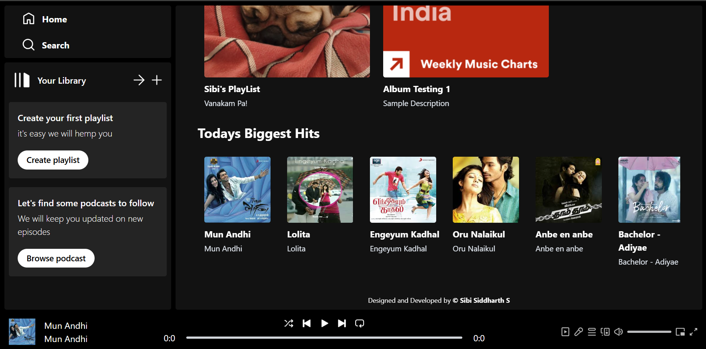
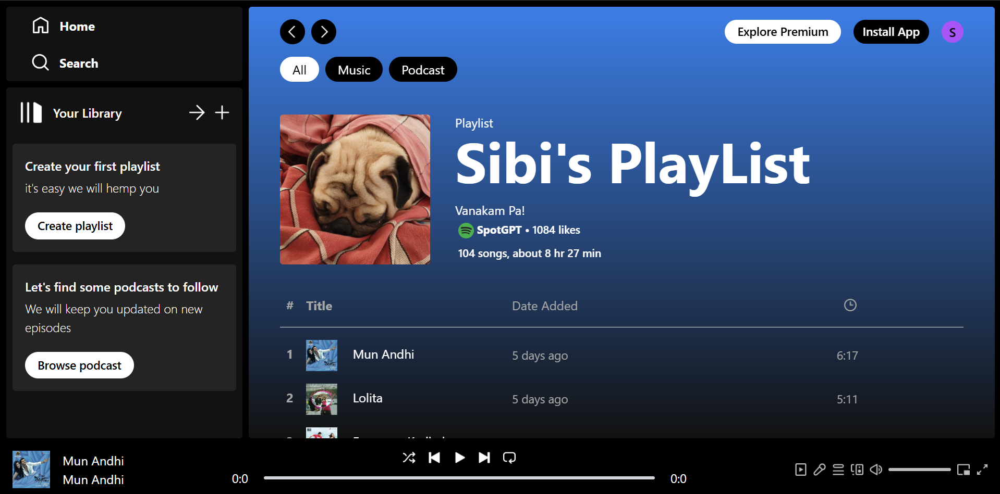
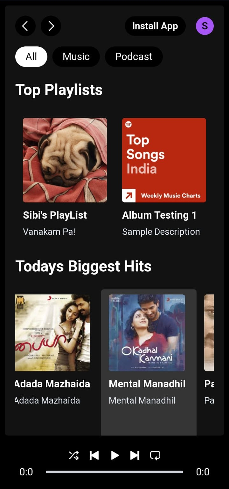
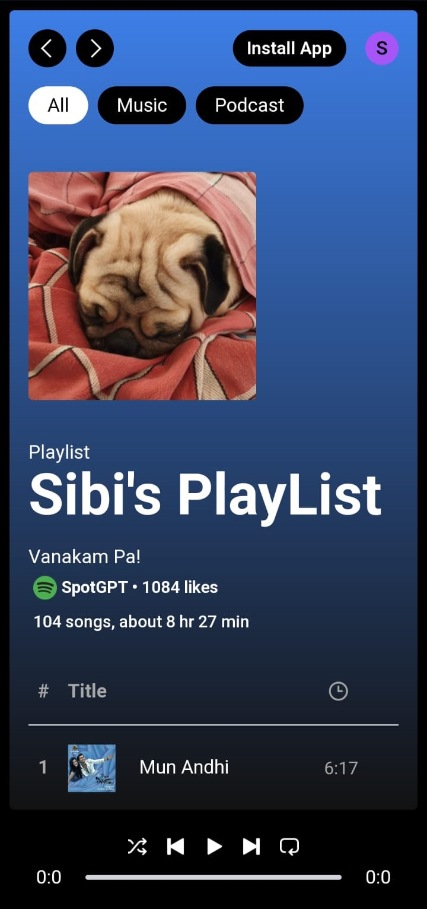
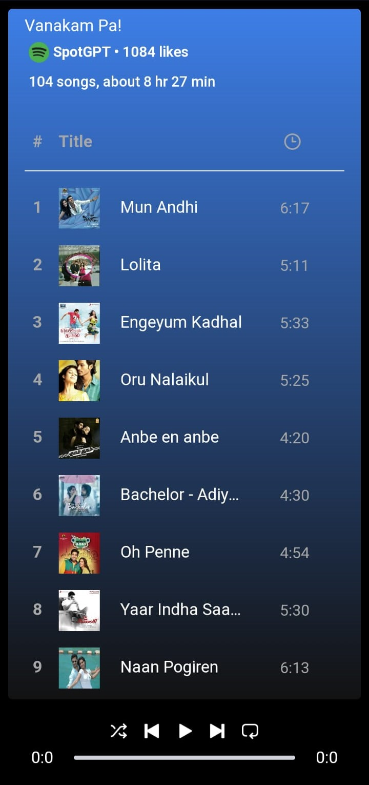

# SpotGPT 🎵
**SpotGPT** is an innovative **Spotify-like music app**—a **clone** built with the **MERN stack** (MongoDB, Express.js, React.js, Node.js) and **Cloudinary** for seamless cloud storage. Designed with both **mobile** and **desktop** users in mind, **SpotGPT** was created to provide an **ad-free** music experience, eliminating the distractions that come with Spotify's free version. It's a **personal project** made to enhance my own listening experience—now, you can enjoy it too!

---

## 🚀 Key Features
- **Home Page**: Explore and navigate through music with ease.
- **Albums & Playlists**: Organize and curate your favorite tracks.
- **Trending Songs**: Stay updated with the latest tracks (only if uploaded).
- **Song Player Controller**: Play, pause, skip, and control volume.
- **Add Songs Portal**: Convenient portal to upload new songs (locally).

---

## 🛠️ Technologies Used
- **Frontend**: React.js, TailwindCSS
- **Backend**: Node.js, Express.js
- **Database**: MongoDB
- **Cloud Storage**: Cloudinary
- **Deployment**: 
  - **Frontend**: GitHub Pages
  - **Backend**: Railway / Render

---

## 📱 Fully Responsive
Optimized for both **mobile** and **desktop** for a flawless music experience on any device.

---

## ⚡ Motivation
SpotGPT came to life as a **personal solution** to the ad annoyance on Spotify’s free version. Instead of suffering through endless interruptions, I wanted an **ad-free** Spotify-like experience, and what better way to create that than with **SpotGPT**? Using the **MERN stack**, I built the app from the ground up to provide seamless, uninterrupted music. 🎧

---

## 🖼️ Screenshots
### Desktop View

|  |
|:-----------------------------------------------------------:|
|  |

### Mobile View

|  |  |  |
|:----------------------------------------------------------:|:----------------------------------------------------------:|:----------------------------------------------------------:|

---

## 🌐 Deployment
- **Frontend**: GitHub Pages 
- **Backend**: Railway / Render

---

## 🤖 License
This project is open-source and distributed under the **MIT License**.

---

## 📞 Contact
- **Sibi Siddharth** (Creator)  
  Email: [sibisiddharth8@gmail.com](mailto:sibisiddharth8@gmail.com)  
  Phone: +91 9629124660

---

Experience music like never before—**without the ads**—with **SpotGPT**! 🎶
